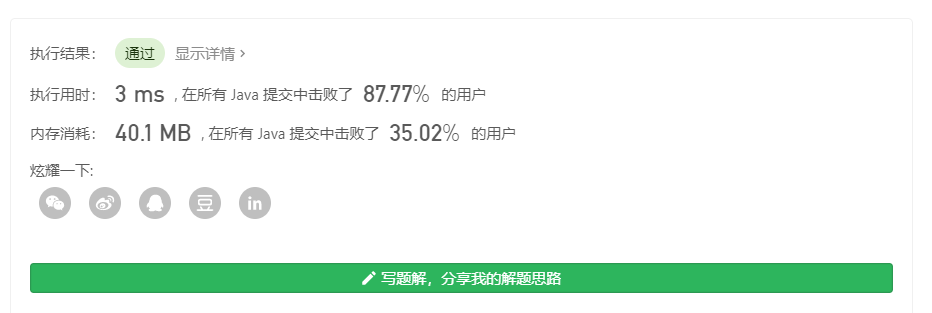

## 40. 组合总和 II（中等）

**链接**：https://leetcode-cn.com/problems/combination-sum-ii/

### 题目

&emsp;&emsp;给定一个数组 candidates 和一个目标数 target ，找出 candidates 中所有可以使数字和为 target 的组合。

&emsp;&emsp;candidates 中的每个数字在每个组合中只能使用一次。

**说明：**

* 所有数字（包括目标数）都是正整数。
* 解集不能包含重复的组合。 

**示例 1:**

&emsp;&emsp;输入: candidates = [10,1,2,7,6,1,5], target = 8,

&emsp;&emsp;所求解集为:
````
[
  [1, 7],
  [1, 2, 5],
  [2, 6],
  [1, 1, 6]
]
````

**示例 2:**

&emsp;&emsp;输入: candidates = [2,5,2,1,2], target = 5,

&emsp;&emsp;所求解集为:
````
[
  [1,2,2],
  [5]
]
````
### 解题思路

&emsp;&emsp;该题和[组合总和 I](../SerialNumber39)类似，区别是数组 candidates 中的数，不唯一且是乱序的。
对于任何数，都有两种情况：选或者不选。但是数组中的数不唯一，所以当已有一种情况选该数后，而在另一种不选该数的后续递归中又选了该数，
从而出现结果重复的现象。为了取重有两种情况，一种是使用 Set 集合（效率低），另一种是判断该数是否已被选过。
我们只需要对数组进行排序，排序后的数组相同的元素相邻。如果该元素不是本次递归中第一次使用则不进行递归。

### 代码

[代码链接](Solution.java)

