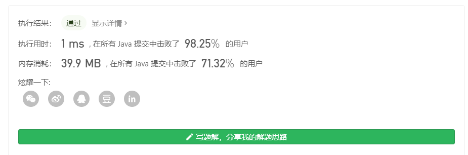

## 107. 二叉树的层次遍历 II（简单）

**链接**：https://leetcode-cn.com/problems/binary-tree-level-order-traversal-ii/

### 题目

&emsp;&emsp;给定一个二叉树，返回其节点值自底向上的层次遍历。 （即按从叶子节点所在层到根节点所在的层，逐层从左向右遍历）

&emsp;&emsp;例如：给定二叉树 [3,9,20,null,null,15,7],
````
    3
   / \
  9  20
    /  \
   15   7
````
&emsp;&emsp;返回其自底向上的层次遍历为：[ [15,7] , [9,20] , [3]] 

### 解题思路

&emsp;&emsp;由题意得：我们只需要对二叉树实现层次遍历即可，使用宽度优先搜索（BFS）进行解题。
由于结果集是自底向上进行层次遍历，所以在遍历完一层节点之后，将存储该层节点值的列表添加到结果列表的头部即可。

### 代码

[代码链接](Solution.java)

